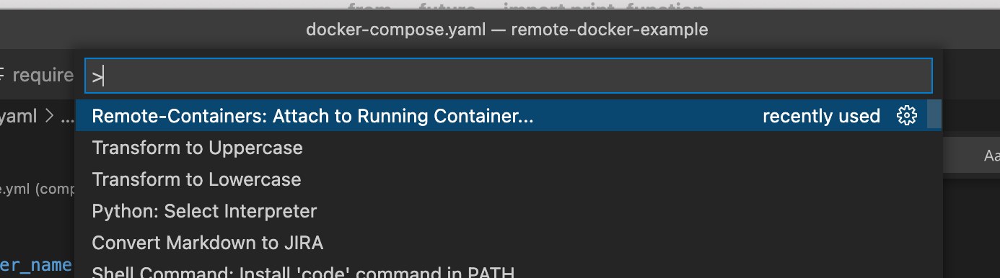
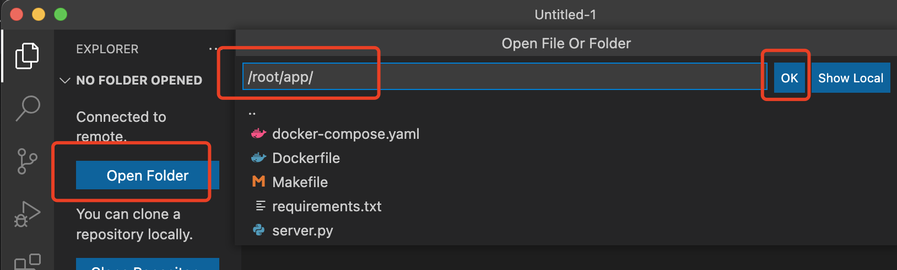
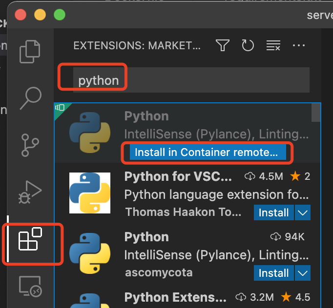
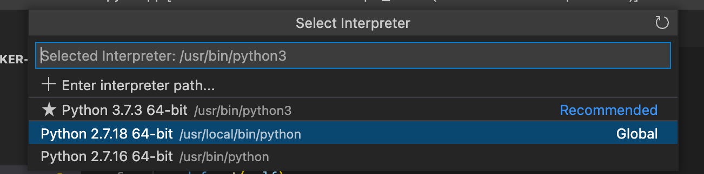

# Intro
Developing within docker container is great, but still have problems such as how to do code jump to third part lib. The vscode-remote-containers handle this.

This project is an example of how to use vscode-remote-containers.

## Steps
1. In host machine `make dev`, ensure container start
2. do the following setup guides.

## Setup remote container and enable code navigation
1. Install the [Python](https://marketplace.visualstudio.com/items?itemName=ms-python.python) extension
2. Install the [Remote - Containers](https://marketplace.visualstudio.com/items?itemName=ms-vscode-remote.remote-containers) extension
3. Open the Command Pallette and type `Remote-Containers`, then select the `Attach to Running Container...` and selecet the running docker container
    
    
    
4. VS Code will restart and reload
5. On the `Explorer` sidebar, click the `open a folder` button and then enter `/code` (this will be loaded from the remote container)
    
    
    
6. On the `Extensions` sidebar, select the `Python` extension and install it on the container
    
    
    
7. MACOS `shift+commad+p` and input “select interperter” , select `/usr/local/bin/python` (If the app start by virtualenv in container, please select the corrent python path.)
    
    
    
8. Wait a while(vscode need time to build all the link, big project more get longer), and you can navigate the code definition
9. Macos control + ~  can open terminal in vscode, and the terminal is the container shell

## Questions
- Close the remote-container vscode and reopen it, do I need to do the setup steps again?
No.

- Restart the container and, do I need to do the setup steps again?
No.

## Enable git commit hook
TODO